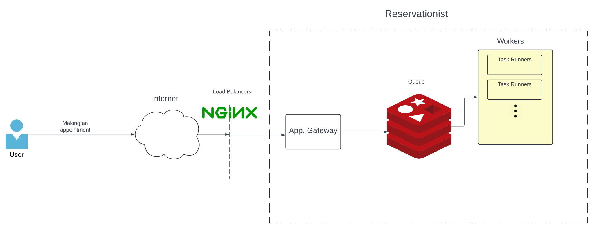

    <h1>Reservationist</h1>
    
    

  <h3>A Restful API written in Go, confirming with DDD principles which you can use to book appointments</h3>

`Reservationist` is an application that makes connection between businesses and customers much easier and faster. By using `Reservationist`, customers can easily browse through working agenda of a business and make appointments. It also supports sending early notification to customers reminding them of their appointments.

## Technical Document

Please find technical documentations/diagrams and design decisions described in the [docs](./docs/) directory.

## System Overview

## Run Locally

To run this application locally, first make sure you have `Docker` installed locallay and then follow these steps:
1. make dev-docker
2. make dev-up
3. make dev-update-apply

